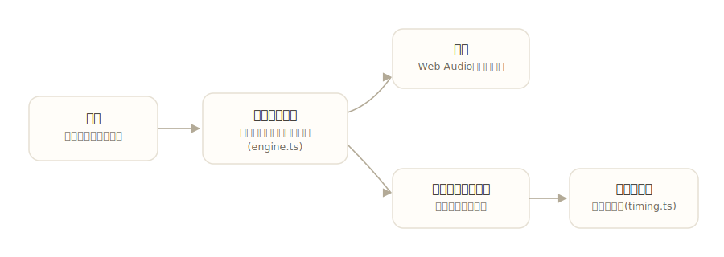

# kizami

[](https://github.com/miruky/kizami/actions/workflows/ci.yml)
[](https://github.com/miruky/kizami/actions/workflows/deploy.yml)

[](LICENSE)

**ブラウザの中で動くメトロノームと、タップの正確さを測るリズム練習。**

公開ページ: https://miruky.github.io/kizami/

## 概要

kizamiはテンポ・拍子・拍の分割を決めて鳴らすメトロノームに、自分のタップが拍からどれだけずれているかを測る練習機能を組み合わせたものである。再生中は振り子と拍ランプが刻みに合わせて動き、音色は3種類から選べる。小節頭にアクセントを付けられる。

リズム練習では、鳴っている拍に合わせてタップパッドを押すかキーを叩くと、最も近い拍とのずれを測り、ぴったり・おしい・ずれ・見逃しの4段階で判定する。走り(早い)・もたり(遅い)の向きとミリ秒、命中率・平均のずれ・ばらつきが集計され、直近のタップが帯グラフに並ぶので、自分の癖が見える。テンポはタップでも設定できる。

メトロノームの刻みは、少し先までの音をあらかじめ予約する先読み方式で鳴らすため、タブが重いときでも揺れにくい。設定はブラウザのlocalStorageに保存され、サーバーへは何も送らない。

Web Audioは利用者の操作を機にしか音を出せないため、最初に再生やタップをした時点で発音が始まる。

### なぜ作ったのか

メトロノームのアプリは多いが、「鳴らす」だけで「自分がどれだけ合っているか」を返してくれるものは少ない。走り癖・もたり癖は数値で見ないと直しにくい。インストール不要でその場で開けて、刻みと自分のタップのずれを同じ画面で確かめられる練習台が欲しかった。正確さを支える先読みスケジューラと、ずれの判定や集計といった規則は、発音から切り離して確かめられるように作っている。

## アーキテクチャ



音を鳴らす部分(`engine.ts`)はAudioContextに依存するため、純粋な計算は分けてある。テンポと刻みの時間計算(`tempo.ts`)、タップの判定・テンポ推定・成績の集計(`timing.ts`)、設定の検証と保存(`settings.ts`)はDOMもWeb Audioも使わない純粋関数で、ブラウザなしでテストする。画面(`app.ts`)はこれらを束ね、鳴った刻みを毎フレーム受け取って振り子・拍ランプ・判定を動かす。

## 技術スタック

| カテゴリ             | 技術                           |
| :------------------- | :----------------------------- |
| 言語                 | TypeScript 5(strict)           |
| 音声                 | Web Audio API                  |
| ビルド               | Vite 8                         |
| テスト               | Vitest                         |
| リンタ・フォーマッタ | ESLint 9 / Prettier            |
| CI / 配信            | GitHub Actions / GitHub Pages  |
| 永続化               | localStorage(外部サービスなし) |

## 使い方

### メトロノーム

再生ボタン(または <kbd>Space</kbd>)で開始・停止する。テンポはスライダ、左右のボタン、<kbd>↑</kbd> <kbd>↓</kbd> キー(<kbd>Shift</kbd> 併用で10ずつ)、「タップでテンポ」のいずれでも決められる。BPMの上にはLargo・Andante・Allegroといった速度標語が表示される。画面右上で配色をライト / OS追従 / ダークに切り替えられる。

| 設定       | 内容                                        |
| :--------- | :------------------------------------------ |
| 拍子       | 1小節の拍数(1〜12)。小節頭のランプが変わる  |
| 分割       | 1拍を四分・八分・三連・十六分のどれで刻むか |
| 音色       | クリック・木・電子音                        |
| アクセント | 小節頭を強く鳴らすか                        |
| 音量       | クリックの大きさ                            |

### リズム練習

メトロノームを鳴らしながら、拍に合わせてタップパッドを押すか <kbd>F</kbd> / <kbd>J</kbd> キーを叩く。判定は最寄りの拍とのずれの大きさで決まる。

| 判定     | ずれの範囲        |
| :------- | :---------------- |
| ぴったり | 25 ms 以内        |
| おしい   | 50 ms 以内        |
| ずれ     | 120 ms 以内       |
| 見逃し   | 120 ms より大きい |

帯グラフは中央が拍ちょうど、左が走り、右がもたりで、直近のタップが並ぶ。平均のずれが一方に偏っていれば、走り癖・もたり癖が分かる。

### テンポを上げる練習

「テンポを上げる練習」を有効にすると、再生中に小節をまたぐたびにテンポが少しずつ上がっていく。1回あたりの増分・何小節ごとに上げるか・目標BPMを指定でき、目標に達したらそこで止まる。速いパッセージを、無理のないテンポから刻んで体に入れるための機能である。

### 制約

- 音が出るにはWeb Audio対応ブラウザでの操作が要る。最初の操作までは無音である。
- 判定はタップした瞬間のオーディオ時計と、鳴った拍の時刻を比べる。入力機器やブラウザのわずかな遅延は補正しない。
- タップの判定は拍頭(四分音符の位置)に対して行う。分割した刻みそのものには判定しない。
- 設定の保存はこの端末のブラウザに限られ、別の端末へは引き継がれない。

## プロジェクト構成

- `index.html` — エントリポイント
- `src/main.ts` — 起動。ストアとメトロノームの初期化
- `src/app.ts` — 設定・振り子・拍ランプ・タップ練習の画面
- `src/icons.ts` — 線画SVGアイコン
- `src/style.css` — デザイントークンとスタイル(ライト・ダーク対応)
- `src/lib/engine.ts` — Web Audioによる発音と先読みスケジューラ
- `src/lib/tempo.ts` — テンポと刻みの時間計算、速度標語
- `src/lib/timing.ts` — タップの判定・テンポ推定・成績の集計
- `src/lib/trainer.ts` — テンポを上げる練習の漸増ロジック
- `src/lib/settings.ts` — 設定の型・検証・永続化
- `docs/architecture.svg` — 構成図
- `.github/workflows/` — CI(lint・テスト・ビルド)とPagesデプロイ

## はじめ方

### 前提条件

- Node.js 22以上

### セットアップ

```bash
git clone https://github.com/miruky/kizami.git
cd kizami
npm install
npm run dev
```

### テストの実行

```bash
npm test
```

### Lintの実行

```bash
npm run lint
```

### ビルド

```bash
npm run build
```

GitHub Pagesではリポジトリ名のサブパスで配信されるため、デプロイ時は環境変数 `KIZAMI_BASE=/kizami/` でViteの `base` を切り替える(`.github/workflows/deploy.yml` 参照)。

## 設計方針

- **正確さは先読みで作る** — 刻みごとにタイマーで鳴らすと処理の遅れがそのまま揺れになる。少し先までの音をオーディオ時計に予約しておき、表示は鳴った刻みを受けて動かす。
- **発音と判定を分ける** — AudioContextに触れるのは`engine.ts`だけにし、ずれの判定・テンポ推定・集計は純粋関数へ切り出す。音を鳴らさずに規則を確かめられる。
- **ずれを数値と形で返す** — 良し悪しだけでなく、走り・もたりの向きとミリ秒、ばらつきを出し、直近のタップを帯グラフに並べる。癖が見えるようにする。
- **状態は1つ** — 設定は単一のオブジェクトに集約し、保存・復元と各部への反映をその差し替えだけで扱う。

## ライセンス

[MIT](LICENSE)
